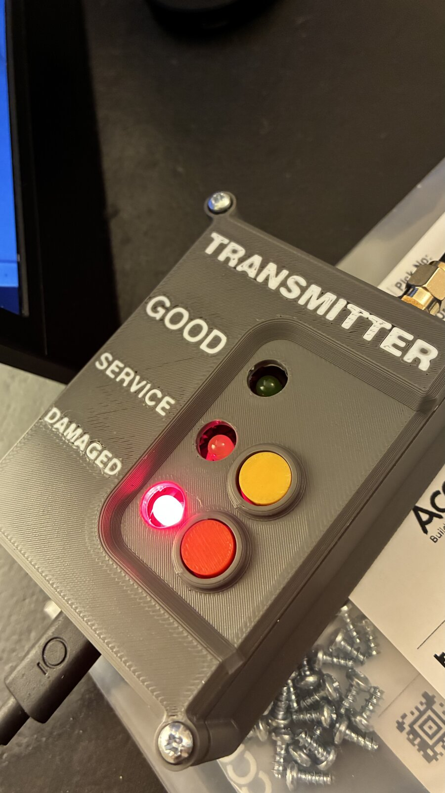
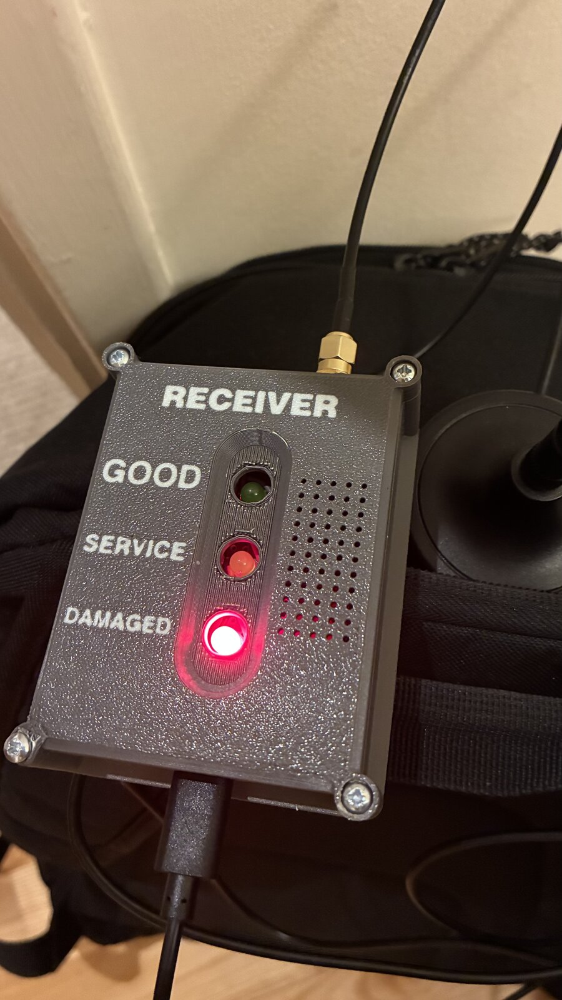
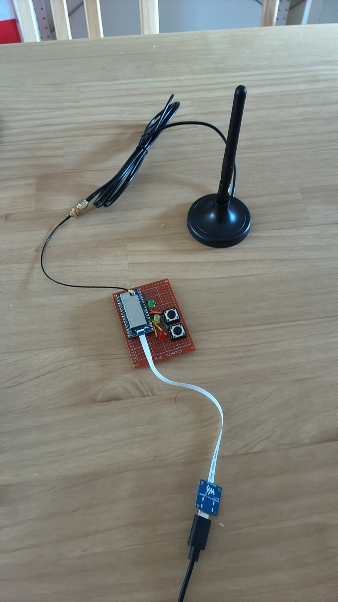
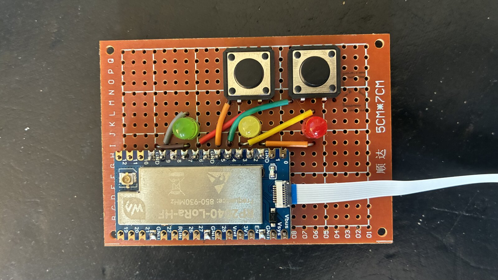
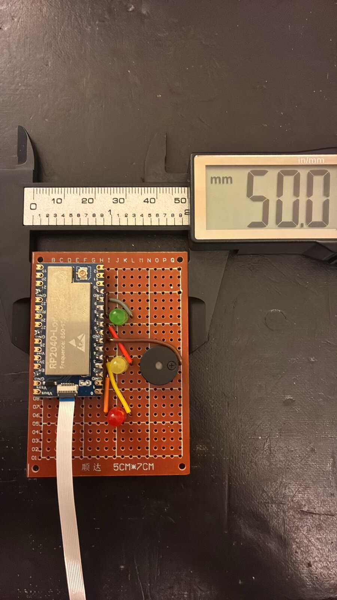
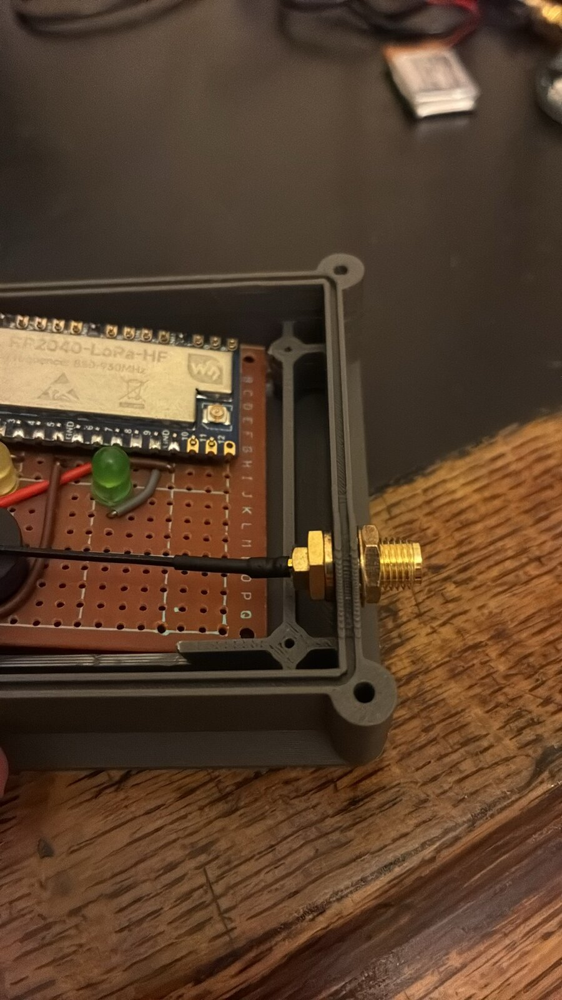
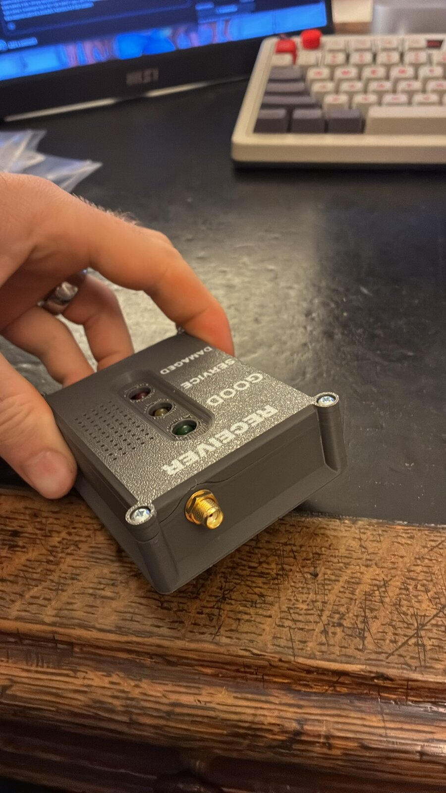
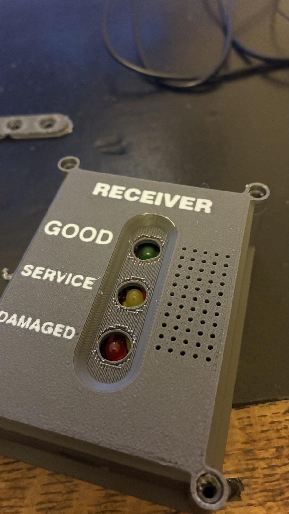

# Rally Proximity Alert System

A pair of long-range LoRa radios that tells a rally service crew when their car is getting close, and what state it's in. They work without any phone signal.

<p align="center">
  
  &nbsp;
  
</p>

## Why

Rally service areas often have poor or no mobile signal, so the crew can't count on a phone call to say the car is on its way, or that it's coming in damaged. We wanted:

1. **An early warning that the car is coming**, by sound and by light.
2. **A rough idea of how close it is**, shown by how fast it beeps.
3. **A simple status message from the car**: is it fine, does it need a normal service, or is it damaged?

## How it works

There are two units, both built on a **Waveshare RP2040-LoRa-HF** board (RP2040 microcontroller + SX1262 LoRa radio, 868 MHz):

- **Transmitter** ([transmitter/transmitter.ino](transmitter/transmitter.ino)) is mounted in the rally car. It has a magnetic roof antenna, green/yellow/red LEDs and two buttons.
- **Receiver** ([receiver/receiver.ino](receiver/receiver.ino)) stays with the service crew. It has matching green/yellow/red LEDs and a buzzer.

### The transmitter

Every 10 seconds the car broadcasts a short LoRa packet: a device ID and the car's current status, e.g. `RACPIDDEN-Y1`.

The co-driver sets the status with the two buttons:

| Action | Status | LED |
| --- | --- | --- |
| Default | **GOOD**, no service needed | Green |
| Tap yellow button | **SERVICE**, fuel / tyres / normal service | Yellow |
| Tap red button | **DAMAGED**, major repairs needed | Red |
| Hold either button for 1s | Back to **GOOD** | Green |

The radio is set to spreading factor 12 at 125 kHz bandwidth. That is the slowest, longest-range LoRa setting, so the signal can still be picked up over the hills and trees of a rally stage.

### The receiver

The receiver listens all the time. It ignores any packet that doesn't carry the right device ID. When a valid packet arrives it:

1. **Lights the LED** that matches the status the car sent.
2. **Reads the signal strength (RSSI)** and uses it as a rough measure of distance. RSSI is limited to between -140 dBm (barely in range) and -60 dBm (very close). It is then mapped onto the gap between beeps:

   ```
   norm        = (rssi + 60) / -80          // 0 = close, 1 = far
   beep period = norm^2.5 × 5000 ms
   ```

   At the edge of range there is a short beep every ~5 seconds. The beeps get faster as the car gets closer, and close to the service area they almost run together. The 2.5 power keeps the beeping slow until the car is properly near, so the crew isn't buzzed constantly while the car is still a long way off.
3. **Times out.** If nothing is heard for 60 seconds, the LEDs and buzzer switch off. The car has either left or is out of range.

Signal strength is a noisy way to measure distance, because terrain, buildings and antenna angle all affect it. It doesn't give an exact distance, but it's plenty to tell "the car is somewhere out there" from "the car is about to arrive".

## The build

### Prototype

The first proof of concept was a bare board, a magnetic antenna and a USB cable. It was enough to show the two radios talking and the RSSI changing with distance.

<p align="center">
  
</p>

### Electronics

Each unit is hand-soldered on perfboard. The LoRa board sits along the bottom edge, with the LEDs (plus the buttons or the buzzer) placed to line up with the holes in the enclosure.

<p align="center">
  
  &nbsp;
  
</p>

### Enclosures

The 3D-printed enclosures have the GOOD / SERVICE / DAMAGED labels printed into the lid, a grille for the buzzer and an SMA bulkhead for the external antenna.

<p align="center">
  
  &nbsp;
  
  &nbsp;
  
</p>

## Hardware

- 2 × Waveshare RP2040-LoRa-HF (SX1262, 868 MHz)
- 2 × external antennas (magnetic-mount on the car)
- Green, yellow and red LEDs for each unit
- 2 × push buttons (transmitter)
- 1 × piezo buzzer (receiver)
- Perfboard, wire, SMA bulkhead connectors
- 3D-printed enclosures
- USB power (power bank or 12V → 5V adapter)

## Software

Both sketches are plain Arduino code, using:

- [arduino-pico](https://github.com/earlephilhower/arduino-pico) (RP2040 Arduino core)
- [RadioLib](https://github.com/jgromes/RadioLib) for the SX1262

Both units must use the same `deviceId`. That way the receiver only reacts to its own car and ignores any other LoRa traffic nearby.

> **Note:** This was built as a one-off for our own use, and this repo is here to show what we made rather than as a step-by-step guide. If you build something similar, check your local radio rules first. The 868 MHz band has transmit-power and duty-cycle limits, and the radio settings here (17 dBm, SF12, one packet every 10s) were chosen for range, not tuned for those limits.

## Credits

- **CAD / enclosure design:** [Tom Pidden](https://github.com/tompidden)
- **Electronics, code, soldering, assembly and testing:** [Matt Pidden](https://github.com/mattpidden)
